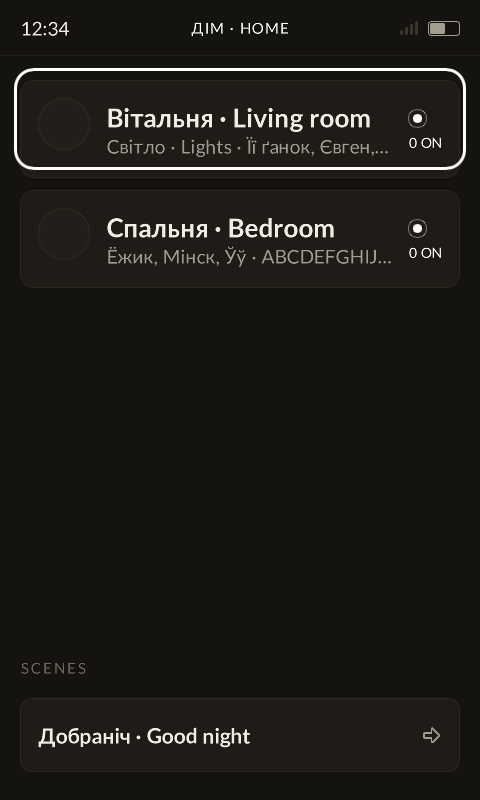
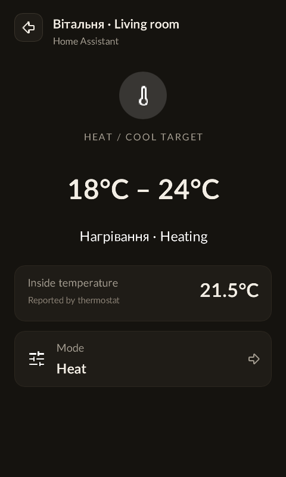
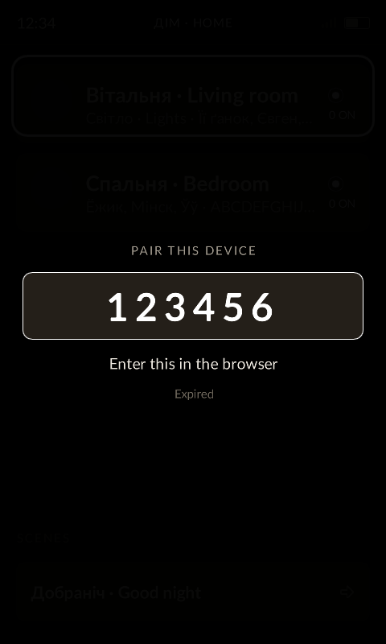

# Slint on this device

Notes that cost time to discover. Slint 1.17.1, software renderer, no `std`.

## The feature set, and why

```toml
slint = { version = "1.17", default-features = false, features = [
    "compat-1-2", "renderer-software", "libm", "unsafe-single-threaded",
] }
```

No `std`, deliberately: that feature turns on system font discovery, which pulls
`yeslogic-fontconfig-sys` - a C library wanting pkg-config and a cross sysroot,
for a device with no font system. This is the configuration Slint's
microcontroller targets use.

## Vector paths: available, but opt-in on two crates

`Path` works in the software renderer. Getting there is not obvious, and two
wrong conclusions came out of it before the right one:

- It is **not** gated on `std`. What is std-gated is the *re-export* of
  `PathData` from `i-slint-core`, which is not what generated code needs.
- The software renderer **does** implement `draw_path`, behind its own `path`
  feature (pulling `zeno` and `lyon_path`).

The feature must be enabled on **both** crates, and the `slint` facade forwards
it from neither, so they have to be named directly:

```toml
i-slint-core = { version = "1.17", default-features = false, features = ["path"] }
i-slint-renderer-software = { version = "1.17", default-features = false,
                              features = ["path", "libm"] }
```

Enabling it on `i-slint-core` alone gives `error: not all trait items
implemented, missing: draw_path` - the trait grows the method while the
renderer's implementation stays compiled out. That error reads as "paths are
unsupported"; it means "half configured".

Note `lyon_path` appears in `cargo tree` regardless: `i-slint-compiler` uses it
at build time. That is host-side and does not reach the target binary.

We are **not** using this today. Measured against rasterised alpha masks it cost
186KB and about 10% more per frame, and the design is authored so every glyph is
a rectangle, a circle or a triangle - so the capability had nothing else to pay
for itself with. If a circular scrubber or an arc meter ever lands, turn it on
and `lucide-slint` becomes nearly free on top.

## Glyph embedding happens at compile time

Glyphs are embedded from strings that appear in `.slint`. A character that only
ever exists in a runtime string is never embedded and renders as a blank gap -
which is what happened to every `·` separator when the subtitles were composed
in Rust. Compose such strings in `.slint` with the separator as a literal.

The compiler seeds that set before it looks at any literal, with `a-z`, `A-Z`,
`0-9`, `●`, `…`, space, and the punctuation `!"#$%&'()*+,-./:;<=>?@[\]^_{|}~`
(see `passes/embed_glyphs.rs`). So the rule bites for anything outside that: an
accented letter, a currency symbol, an arrow - and, of printable ASCII, the
backtick, which is the one character the seed leaves out.

Runtime Russian, Ukrainian and Belarusian names are covered by the
`runtime-cyrillic-glyphs` input property in `app.slint`. Keep it as an input:
the compiler must retain the literal even though no UI element displays it.
The renderer still embeds a bounded character set; this is not unrestricted
Unicode support. `tests/runtime_fonts.rs` renders each supported Cyrillic
character and the runtime temperature symbols through the production font
resources in both weights, and fails if a glyph becomes blank.

`build.rs` enables Slint's signed distance field (SDF) font embedding. Each
Lato face stores one scalable glyph set instead of a bitmap at every size.
Enable `sdf-fonts` on the **build dependency** `slint-build`; this does not add
runtime font libraries or system-font discovery. The existing font selection
and software renderer remain in use.

With ordinary bitmap embedding, the cost of a size was the whole character
set at that size, in every face, growing as the square of the size. Historical
measurements against this UI were 32KB at 20px, 40KB at 26px, 162KB at 48px and
327KB at 72px. Those per-size costs no longer describe the SDF build. Slint
chooses the SDF source resolution from the detected size range, so increasing
the largest font can still increase the payload.

The ARMv7 release comparison for Cyrillic coverage used the same compiler,
optimization and target settings: the previous executable was 11,536,300
bytes, adding Cyrillic with bitmaps produced 12,695,308 bytes, and Cyrillic
with SDF produced 10,591,852 bytes. A controlled gzip repack of the .165
runtime bundle, replacing only the GUI, saved approximately 327 KiB with SDF
compared to the previous executable. These are comparisons, not release hashes.

[Slint documents](https://docs.slint.dev/latest/docs/rust/slint_build/struct.CompilerConfiguration#method.with_sdf_fonts)
a rendering-speed and visual-quality tradeoff for SDF. Validate small text,
large pairing digits and Cyrillic on the HA100 when changing font inputs or
Slint versions. SDF also honors dynamic pixel sizes directly; bitmap fonts
previously selected an available smaller size. In particular, the thermostat
now uses its requested 46px range and 76px single-target sizes. The HA100
comparison measured about 0.20ms (5.2%) more rendering work with SDF; see
[the device results](slint-performance.md#cyrillic-font-comparison-2026-09-16)
and [benchmark procedure](slint-performance.md#repeatable-device-comparison).

Headless samples of the production UI, using runtime Cyrillic text:

| Home | Thermostat range | Pairing PIN |
| --- | --- | --- |
|  |  |  |

`SLINT_FONT_PATH` and `SLINT_DEFAULT_FONT`, set in `build.rs`, choose the face.
Ship every weight the UI asks for: `font-weight: 600` against a single Regular
face gets synthesised rather than resolved.

## `.slint` can grow a string but not shrink one

The string members are `is-empty`, `character-count`, `is-float`, `to-float`,
`to-lowercase`, `to-uppercase`. There is no substring, no slice, no index. `s +
"a"` is available; taking that `a` off again is not, which means a backspace
cannot be written in `.slint` at all.

`TextInput` is the way out, and it is worth reaching for rather than working
around: it owns a real buffer, a cursor, `input-type: password`, and
scroll-to-cursor. It can be driven without ever being typed into - its
`key-pressed` callback runs *before* its own handling, so a D-pad's arrows can
be claimed before it sees them, and a delete is `set-selection-offsets(n-1,
big)` then `cut()`. `cut` copies to the clipboard first, but
`Platform::set_clipboard_text` defaults to a no-op and this device implements
none, so nothing escapes. Offsets are bytes, and are clamped rather than
checked: an offset past the end lands at the end.

Set `text-cursor-width`, `color`, `selection-background-color` and
`selection-foreground-color` explicitly. Anything left unset is filled in from
StyleMetrics and the palette by a compiler pass, which pulls the widget style
into a binary that has no widgets in it.

## A component's root cannot see `parent`

A component's own root has no parent at definition time, so `parent.width` there
is an error. Either measure off `root` (its own geometry, set by the caller) or
take the value as a property. The focus ring takes the box it rings; the volume
overlay is positioned by its caller.

## `border-radius` does not round a gradient

The software renderer rounds a solid `background`, but a `@linear-gradient` one
is drawn square whatever the radius says. Put the gradient in a child of a
`clip: true` rectangle when the shape matters. The light screen's colour
temperature bar does that; its brightness bar, a solid colour, needs nothing.

## DirtyRegion holds three rectangles

```rust
/// The maximum number of rectangles that can be stored in a DirtyRegion
pub const MAX_COUNT: usize = 3;
```

Past three, `add_box` merges new boxes into whichever rectangle grows least,
"simplified by being bigger than the actual union". A state change touching six
elements collapsed into three bands covering 80% of the panel, and the renderer
faithfully redrew all of it - a partial update that cost more than a full
redraw.

The rule that follows: **make a state change move one element rather than
restyle many**, and never express as geometry what can be expressed as colour
(changing `border-width` changes geometry; changing `border-color` to
transparent does not). Replacing a per-row selected state with one moving
highlight took the dirty region from 80% to 7-14% and the frame from 8.3ms to
2.2ms.

## An `animate` on a binding reads its duration a frame late

A property with an `animate` block comes in two kinds, and the compiler
generates different code for them (`i-slint-compiler/generator/rust.rs`):

- a **binding** (`y: fs.ring-y;`) becomes `set_animated_property_binding`,
  with the `duration:` expression wrapped in a closure;
- an **imperative set** (`self.scroll = x;`) becomes `set_animated_value`,
  with the `duration:` expression compiled inline - evaluated at the set.

For the binding, a changed dependency only flips its state to `ShouldStart`
(`AnimatedBindingCallable::mark_dirty` in `i-slint-core`
`properties/properties_animations.rs`). The closure is not called until the
property is next *evaluated* - the next frame, in the `ShouldStart` arm of
`evaluate`, which calls `compute_animation_details` and reads the value
afresh. So a flag turned off and back on around a change, in one callback, is
never seen off: the duration read is the one after the flag came back.

What it cost: `begin-swap`/`end-swap` bracketing a page swap were believed to
make the ring land and did nothing, and a 90ms opacity fade was quietly hiding
a 160ms tour of the ring from the old page's row to the new one's - visible
whenever the two rows differed.

The rule: **anything whose animation must be on for some changes and off for
others is set imperatively, never bound.** `scroll` always worked that way;
the ring now does too, and the two are set in the same call so they share a
curve.

## A layout overwrites a child's cross-axis position, silently

A child of a `VerticalLayout` (or `HorizontalLayout`) with no cross-axis
`alignment` has its `x` (respectively `y`) binding replaced by the layout's
padding: `i-slint-compiler/passes/lower_layout.rs`, the `stretch_bindings`
else-branch, `bindings.insert(pad...)`, with no diagnostic. `SectionLabel { x:
6px; }` under a `VerticalLayout` with `padding-left: 14px` lands at 14px and
nothing says so. Measured on the device: the label's ink at x=14 where the
cards start at x=20, and the binding that asked for 20 sat there looking
correct.

The rule: inside a layout, inset on the cross axis with padding, or wrap the
element in a plain `Rectangle` and position it inside that, where `x` is
honoured.

## What things actually cost here

Measured on the panel, 480x800:

| | cost |
|---|---|
| memcpy RAM -> framebuffer | 1.3 ms |
| alpha blend, full screen | 11 ms |
| hub focus move (71% dirty) | ~22 ms |
| hub page slide, average | ~10 ms |
| hub page slide, worst | 22-25 ms |

Anti-aliased rounded rectangles dominate. This content runs at roughly 80ns per
pixel against 14ns for flat cards, because a row card, a 26px icon disc and a
focus ring are all rounded and all anti-aliased. Any estimate taken from a
simpler screen will be optimistic by several times - measure the real thing.

`COUCH_REGION=1` prints what the renderer marked dirty each frame. A frame that
costs far more than its content suggests is almost always claiming a larger
region than it needs, and that is invisible without it.

## Dirty regions: what costs a frame, measured on the HA100

`COUCH_REGION=1` prints every rectangle the renderer marked dirty, with
geometry. Read it before optimising anything: three separate theories about a
stutter here were wrong, and the rectangles settled it in one run each.

The case: the focus ring appeared to skip. It did not - the animation frames
were a tidy 12% of the screen at ~2.2ms, stepping 1-2px. Every focus move also
emitted **one 452x654 frame, ~23ms** immediately before the animation started.
The move hitched, then glided.

Things that turned out **not** to be the cause, each disproved by measurement:
the animation itself (removing it left the frame exactly where it was); the
ring's clamping; an `animate` block whose duration read a property; a layout
feedback loop in the row window; the dot indicators; focus arriving as a bound
`in property` versus an imperative function call; focus owned by the component
root versus a zero-size child; and the ring living inside a clipped, scrolling
subtree.

What it was: **three focus rings, one per section.** Each had a `focused`
expression over `focus-row`, so all three re-evaluated on every move - including
moves between rooms, where two of them answer false before and after. Two of
those rings sat at the very top and the very bottom of the pane, and
`DirtyRegion::MAX_COUNT` is 3: past three rectangles Slint merges, and the merge
of "something at the top, something at the bottom" is the whole pane.

Two lessons worth keeping:

**Slint propagates on dependency, not on value.** Hoisting the expressions into
named `bool` properties changed nothing. If an element must not repaint, it must
not *depend* on the changing property at all - naming the expression is not
enough.

**Count your dirty rectangles.** Past three they merge into a bounding box, so
two cheap changes far apart on screen cost more than one expensive change. The
fix was one ring for the whole pane, positioned over whichever cell or row has
focus: one reader, one band.

Bisect by disabling readers, not by reasoning about them. Setting each
`focused:` to a constant `false` in turn took twelve moves from thirteen
oversized frames to one and named the culprit in a single run, after several
hours of plausible theories had not.

Section offsets for that single ring are arithmetic over the same furniture
heights the row window uses, not read back off laid-out elements - reading the
layout back is its own trap, see the note on the row window above.
## Pacing: a timed sleep, because the pan ioctl stalls while a key is held

`FBIO_WAITFORVSYNC` returns EINVAL on mtkfb. `FBIOPAN_DISPLAY` with the
startup screeninfo and zero offsets blocks about 17ms on an idle panel and
changes nothing about what is shown, and it was the pacing wait for a day.
Then a real session showed the loop held for 0.5-6s at a time with key
presses queuing behind it. Reproduced with a sampler on the device: for
exactly as long as any key is held, the GUI thread sits in
`cmdqCoreWaitResultAndReleaseTask` under the pan, burning *system* time
(5.3s of it in one hold), and nothing else on the single online core runs -
not the sampler, not the microphone thread, whose recording came out 0.1s
long. The keypad rescans every 8ms while a key is down (the debounce this
project lowered), `kworker/0:1` takes ~22% of the core doing it, and that is
enough to wedge the display's command queue. Touch, audio, and idle gaps were
each tested and cleared first.

So `panel.rs` paces with a sleep to 16.67ms after the draw began. It never
enters the kernel to wait, and at 60Hz nobody can tell it from vsync. The
ioctls remain behind `COUCH_VSYNC=auto|pan|wait` for experiments, and any
pacing wait over 100ms demotes to the sleep for the life of the process.

Measured under COUCH_NAV, seven ring moves per five seconds:

| | frames / 5s | work per frame |
|---|---|---|
| unpaced (before) | ~600 | 2.0 ms |
| paced by the pan, `interactive` governor | 70-77 | 6.3 ms |
| paced by the pan, `performance` governor | 69 | 3.3 ms |
| paced by the sleep, `interactive` governor | 70-77 | 6.5 ms |

The work per frame went up because the clock went down, not because the
frame changed: the governor is `interactive` with a 604.5MHz floor, and once
the loop sleeps between frames the clock sits there and bounces to 1.3GHz on
load. A ring frame fits the 16.7ms budget at either clock. A page-slide frame
does not - 10-25ms at full clock becomes up to 29ms - which is the argument
for making the slide a copy of two rendered pages rather than a
re-rasterisation of both every frame.

## A page slide is a copy of two frames, not a render of two pages

A page transition here does not animate anything in Slint. The host (see
`transition` in `main.rs` and `Panel::slide` in `panel.rs`):

1. keeps the frame on the panel - the RAM buffer, which equals the panel
   between draws - as page A;
2. applies the change to the UI in one go, as an instant state change: new
   models and `page-swapped()` for an area, `chooser-shown` flipped for the
   chooser, with `ring-hidden` true;
3. renders that once into RAM, with no copy to the panel and no pacing -
   page B. The renderer's partial redraw is fine with this: RAM still holds
   the last frame it drew, and the dirty region is what the change touched;
4. for ~180ms, composes the framebuffer directly from A and B, shifted along
   the same `ease-out` curve everything else uses, one or two `memcpy`s per
   row, pacing each frame with the same FBIOPAN_DISPLAY wait a drawn frame
   gets. Rows that must not move - the status bar, and the pager on an area
   change - are taken from B throughout;
5. clears `ring-hidden`, so the next normal frame starts the ring's 200ms
   fade in. RAM already equals B, and so does the panel.

Why: the rasterised slide - two `AreaPane`s on a strip whose `x` animated -
redrew both pages every frame, 88% of the panel, 10-25ms at full clock and up
to 29ms at the `interactive` governor's floor, against a 16.7ms budget. A copy
of the whole panel is ~1.3ms at any clock. It also removed a prep timer (so
the incoming page was instantiated before the first moving frame), a settle
timer, `*-next` models and a `sliding` flag, none of which the copy needs.

### The same two buffers, cut to a rounded window: the iris

A light's or a blind's controls do not arrive from the side. They open out of
the row that was pressed, as a rounded window onto page B that starts on that
row's card and grows to the whole panel, with the focus ring riding its edge;
Back collapses the same window back onto the same row. `Panel::iris` is the
slide's machinery with the run boundaries worked out per row instead of once:

- **Three runs a scanline instead of two** - page A, page B, page A - so a
  frame costs what a slide frame costs, about 1.3ms of copying, and nothing is
  blended or re-rasterised at any point in it. The corner radius is an inset
  on the `2r` rows at each end, one integer square root each over a radius of
  a dozen pixels; every other row is two comparisons.
- **Both ends of the travel are parameters** (`panel::Window`, a rect and a
  radius), so the same compositor would open a device row into its packaged
  controls if that is ever wanted. The row's box is read from the list itself
  (`RoomDevices::ring-position` and its neighbours) at the moment of the
  press, so a scrolled list, a taller row or a different corner all move the
  window with them.
- **The last frame is the page that is arriving, whole.** A close stops on the
  row, which is still a window full of the page that is leaving, so the final
  frame puts the page behind it up entire. That is a handover at the smallest
  the window ever gets, and it keeps the slide's invariant: when a transition
  returns, RAM and the panel agree again.
- **Three shapes, and a switch for trying them.** The row curtain is the same
  window with a different first rect: the row's band across the whole panel,
  opening up and down (`Transition::from_row`). While the shapes are being
  judged on the device, `/tmp/couch-transition` chooses: `echo "curtain 220" >
  /tmp/couch-transition` is the curtain at 220 ms from the next press, `iris
  300` the iris, `lift` or `lift 400` the lift, and no file is the default.
  Each shape has its own default time; a number in the file overrides it. It
  is read once per opening from a RAM disk and is gone at the next boot.
  Remove the switch when a shape has been chosen.
- **The ring is not faded.** A fade is a per-pixel blend of two layers, which
  is the one thing this compositor never does; the ring is filled as a
  `ring-width` outline on the window's edge and rides it all the way: it sits
  outside the window, so it leaves the panel by itself as the window reaches
  the edges (`IRIS_RING_UNTIL` cuts it off earlier if that is ever wanted). `IRIS` is the duration and the three
  `IRIS_RING_*` constants are the rest: they are there to be turned on the
  device.

### The lift: sprites, reveals, and blending a quarter of the panel

The lift is the one shape here that is not a window. The room falls away from
the focused row outwards, that row's card rises into the header band with its
name and its icon riding on it, and the control screen arrives piece by piece.
It is still composed from the same two buffers, and it is worth reading how it
got here, because the obvious version was the wrong trade.

**The first version cross-faded the whole panel** - one blended scanline where
the other shapes do one `memcpy` - and measured on the HA100 at **9.1 to 10.4
ms a frame, worst frames 12 to 18 ms, and one frame of 38.5 ms** against a 16.7
ms budget, where the iris and the curtain hold 60 fps. It also did not look
like the thing it was copying: in a cross-fade nothing travels and nothing
grows. Both problems have the same answer - do not touch every pixel.

- **Sprites.** A rectangle cut out of a page once, before the first frame, into
  a small owned buffer, and put down at an interpolated place on each frame:
  the row's name and its icon, a few tens of kilobytes between them. `put`
  clips at all four edges and takes a **colour key** - the card the name was
  cut from - so that only the glyphs travel and the plate under them stays
  behind. A compare a pixel over a few tens of thousands of pixels, against a
  blend over three hundred and eighty thousand.
- **The rising card** is a filled rounded rectangle in `Theme.surface` with a
  pixel of `Theme.border` round it, interpolated from the row's rect to the
  header band's. It is the focus ring's own row-run arithmetic, filled instead
  of stroked, over a rectangle that is never more than a tenth of the panel.
- **A card reaches the frame once, as one piece.** A bar card is built up
  opaque in a buffer of its own first - the page's own card, with the level
  un-revealed and the marker moved - and only then blended over the frame, at
  the alpha it has reached. Anything painted straight into the frame at its own
  strength shows through a card that has barely arrived: the level's track used
  to be, and cut a dark strip through the room's rows down the width of the
  bar while the card behind it was still nearly transparent.
- **Reveals, not redraws.** The level bar's fill and the colour marker are
  already in the page at their values, so neither is drawn: the fill is
  un-revealed from the top by painting the empty part of the track in the
  colour the page gives it, and the marker is moved by painting over it with
  the gradient from just above and putting it back where it has got to. The
  geometry - track, fill height, marker - is exported from `light.slint`
  rather than written down twice.
- **Blending, banded.** The only real blending is the room falling away, and a
  band is blended only while it is inside its own short window: before it the
  band is a copy of the room, after it a fill. One band is one row's pitch, so
  a card is never caught half faded, and `LIFT_BAND_FADE` is about twice
  `LIFT_BAND_STEP`, which holds the blended part of the panel to **roughly a
  quarter** at any instant however many rows there are.
- **Nothing appears or disappears in one frame.** Every element that is not
  in both pages fades, over at least a fifth of the transition - five frames
  at the default time - and the alpha ramp is a smoothstep, flat where it
  starts and where it stops, so there is no step at either end either.
  `ease_out` is right for a thing that travels and wrong for a thing that
  appears: it opens at its fastest. The card that rises fades *in* over the
  same window the row underneath it fades *out*, so the two cross and the
  row's second line and chevron are never hidden in a frame, and it fades
  *out* across its rise, so page B never has to lose a plate it never had -
  that last one is what the owner saw as "the grey background of the room row
  popping". The name and the icon travel on a smoothstep too, so they do not
  separate from the row while the row is still there and read as doubled.
  `the_control_screen_opens_as_a_window_out_of_its_row` holds the rule: over
  the frames a default-length lift actually draws, no patch of the panel may
  do more than 40% of everything it ever does in one frame, unless it is a
  piece that is on screen in *both* of the two frames and has therefore moved
  rather than appeared.
- **A thing that travels leaves its place.** The band the focused row fades
  away as is a copy of itself with the name and the icon painted out in the
  colour of the card they sat on - the same colour the sprites are keyed
  against, so the glyph edges land back on exactly it and leave no halo. Two
  copies of a name, one flying and one fading where it started, is a ghost,
  and it is what the row used to leave behind. Its second line and its chevron
  do not travel, so they stay in the band and fade with it. The first frame is
  still the room exactly: at that point the sprites sit on their own source and
  put back precisely what was painted out.
- **What it costs, and where that went.** The rule that nothing pops cost
  about twice what the lift cost before it: measured on the HA100 at 500 ms,
  a mean of 8.6-10.1 ms a frame and worst frames of 12-17, against a 16.7 ms
  budget. A speed pass took that to a **mean of 0.26 and a worst frame of 0.29
  panels of blending** in the profile the tests print, from 0.70 and 1.22 -
  about 3.4 ms a frame on the device's own calibration. Four things did it:
  a run of one colour fades to one colour, so it is **filled and not blended**
  (most of a card's height); the header, state line and footer fade only over
  the part of each row that **has anything on it**; a bar card is **cut once
  and patched**, not rebuilt every frame; and the frame buffer and the card
  scratches are **allocated before the clock starts**, which is what made an
  open cost more than a close and once put a single frame at 34 ms.
- **The travellers are drawn last**, after every fade, so nothing arriving can
  clip the name or the icon on its way.
- **A traveller lands on itself.** The row and the screen draw the device's
  name at one size (`Theme.device-name`) and its icon with one component
  (`components/device_disc.slint`), so the hand-over is nothing at all rather
  than two drawings swapping places. A screen that adopts the lift uses the
  same two. The test asserts it: at the best offset within a pixel, a
  traveller's source and its landing may differ by no more than a shade.
- **Blending only where there is anything to blend.** A room is mostly its
  background, so one pass before the first frame records where each scanline
  has content and the fade touches only that span. On a list that is about
  three quarters of the panel rather than all of it.
- **Nothing hands over to nothing.** A painter puts its pieces down in order,
  so it cannot fade the arriving page in *underneath* the one that is leaving
  the way the preview does. Instead the room is gone by about a quarter of the
  way through and the screen's cards come in just before the last of it, the
  state line shortly after, and the name and the disc at the hand-over. The
  cards deliberately overlap the tail of the fall by a few frames: a card
  arrives over a band that is most of the way faded already, which is cheaper
  to look at than a panel with nothing on it.
- **Nothing reads the framebuffer back.** Every blend writes; the sprites and
  bands copy. A framebuffer is mapped for writing, and reading it back is far
  slower than reading RAM - which the first version did, for its travelling
  card, on every frame.
- **A whole frame at a time.** The window shapes write every scanline exactly
  once - three runs of A, B, A - so they can paint straight into the map. The
  lift cannot: it flattens a band and puts its pieces back in later passes, so
  a pixel is written up to five times and the *first* of those writes is the
  flat background. The panel is scanned out continuously and nothing here
  flips buffers, so painting that in place is seen half done. On the device it
  showed as a dark bar walking up the screen, several times over a slow lift,
  and not at all on the iris or the curtain. So a lift composes into a RAM
  buffer - one, kept, never per frame - and `present` copies it to the map in
  one pass, top to bottom, one write a pixel. It costs a panel copy, about a
  millisecond, and it is the price of painting in passes at all.
- The crossing itself now does **two pixels an iteration**, four channels
  packed in the halves of a `u64`. Ten milliseconds for a panel where a
  `memcpy` of the same is 1.3 is far more than a dozen integer operations a
  pixel should cost, so it was not being widened; halving the iterations is
  the part of that worth having without reaching for intrinsics.

**The name is the same size in both places.** `Theme.device-name` is what a
room row gives a device's name and what the control screen gives its title, so
the sprite lands on the title it is replacing and the hand-over is a cut with
nothing to fade. The two have different widths available, so a long name can
elide differently in the two places; the last frame is the page itself, whole,
so any difference is gone by then.

What the preview has and this still has not: the row's label and the screen's
title are the same size now, but the **second line** is not - a row shows the
device's state where the screen shows where it is and what drives it, so those
words change at the hand-over. The renderer version of the whole thing would
be 10-29 ms a frame by the measurements above, so it was not written.

Every opening prints what it cost when it is over - frames, the mean work per
frame and the worst one, in microseconds - and `COUCH_REGION=1` prints each
frame as it goes, the same for all three shapes.

A press that only switches a row must not arm it (`screen_pending` in
`lights.rs` asks the row the same question `poll` does), and Home leaves the
room altogether, so it keeps the room list's own transition rather than
growing a window onto a page that is no longer there.

Two things the mechanism depends on:

- **The callbacks only record what they want.** `draw_if_needed` cannot be
  re-entered from inside a Slint callback, and the transition draws, so
  `area-step`, the chooser openers and every way the chooser closes - Escape,
  Left, Right, `chosen` - set an intent that the loop performs after
  `dispatch_event`. The closes that used to write `chooser-shown` from inside
  the FocusScope became a `close-chooser()` callback for this reason. Keys
  pressed during the slide queue in the keypad and are taken one per frame
  afterwards; a second Left simply slides again.
- **Change handlers run from `update_timers_and_animations`**, after the
  animations and timers (`platform.rs`). The chooser's `changed shown` is
  what puts its list back to the top, so that call goes between the state
  change and the B render, or B shows the list where it was last left.
- **The animation clock only advances in that same call.** An animation's
  start time is `current_tick()` at the moment its property is marked dirty
  (`AnimatedBindingCallable::mark_dirty` -> `reset()`), and the tick is the
  one `update_animations` last set. The slide blocks for 180ms without
  calling it, so clearing `ring-hidden` straight after would start the fade
  180ms in - the ring pops. The call is made once more before the flag is
  cleared. Anything that blocks the loop and then starts an animation needs
  the same - and it bit again in standby: a backlight write blocks 110ms in
  the display driver, and a key dispatched after one ran its ring move in two
  frames instead of ten until `wake()` refreshed the tick first.

The ring's hide is a bound `opacity` with `duration: ring-hidden ? 0ms :
200ms`. That works despite the animate-on-binding note above because B is
always rendered - the binding evaluated - with the flag true before it comes
back false, so each duration is read under the flag it is for. The old page's
ring simply leaves with it on the snapshot; nothing fades out.

Measured on the device, COUCH_SLIDE with COUCH_REGION, `interactive`
governor at its 604MHz floor:

| | cost |
|---|---|
| page B render, area change | 14-19 ms, once per slide |
| page B render, chooser | 22 ms, once |
| transition frame (compose + copy) | 1.4-3.7 ms |
| frames per slide | 11 at 180 ms, each paced 14-17 ms |
| stat line under COUCH_SLIDE, before | 132 frames / 5s, 8.2 ms avg, 28.9 ms worst |
| stat line under COUCH_SLIDE, after | 79 frames / 5s, 4.6-5.6 ms avg, 19-26 ms worst |

The worst frame is now the one B render; every moving frame is under a
quarter of the budget. A burst of 120 framebuffer captures across the slides
saw 20 distinct states of a card row and 3 of the pager band - the band
changed only when the pager's state did.


### Whole-row list windows

Room, device and scene lists size cards to fit a whole number of visible rows.
The minimum card heights remain 90px for rooms/devices and 72px for the chooser;
extra window space is distributed across those rows. Twelve-pixel gaps leave
clearance for the six-pixel focus outline. These measurements come from the
page height and fixed footer, avoiding a layout feedback loop.

Scrolling animates between whole-row destinations (160ms for rooms/devices,
140ms for the chooser). Rows pass through the viewport edges during motion,
then settle with complete rows visible. Scroll decisions use the destination
rather than an intermediate animation position, including on rapid presses.
The focus outline follows the same curve; page slides are unchanged.
On-device framebuffer checks with nine rooms, eight devices and twelve scenes
verified full cards at the top and after scrolling. Use an isolated configuration
for these checks so household devices and saved configuration remain untouched.

A room page's device rows and its scenes card are one ring of stops, and one
outline marks them, in page space with the scroll already taken off, the way
the area pane does it. It was two outlines, one inside the scrolling content
and one on the card, and neither could travel to the other: a wrap onto the
card swapped them where they stood, and a wrap back off it brought the first
one in at the position it had been left at, the top of the list, to slide down
from there behind the scroll. The card is furniture below the window rather
than a row in it, so wrapping onto it moves only the outline; wrapping off it
scrolls to the last row under an outline going straight there.


### Full Lucide catalog

The saved icon name resolves through the generated model catalog. The GUI
embeds a 1,196,352-byte alpha atlas (2,077 × 24 × 24); icons.rs expands only
requested icons into cached RGBA images. Selection never downloads images or
parses SVG on the remote. tools/build-icon-catalog.py regenerates both the
catalog and atlas from the pinned, licensed SVGs under assets/lucide.
