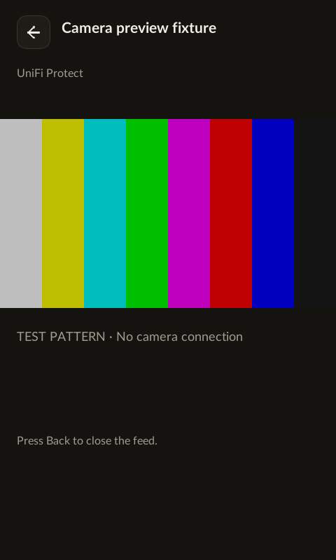
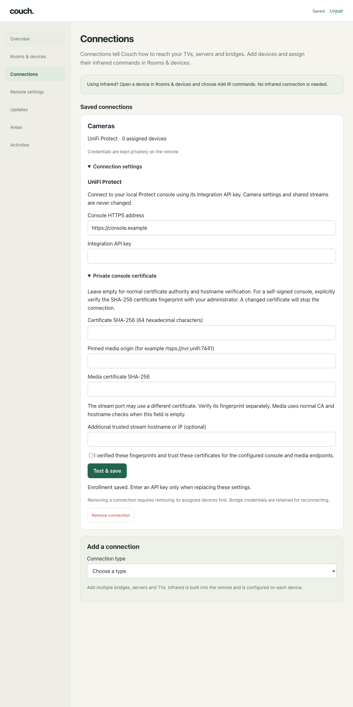

# UniFi Protect camera client

`clients/couch-unifi-protect` is a read-only Rust client for the official local
Protect Integration API. It discovers cameras, retrieves a bounded JPEG snapshot,
and plays existing low-quality H264 streams in the native Slint camera screen.
Enrollment and camera selection are available in the browser configuration UI.
Couch does not enable shared streams, change camera settings, receive events,
or authenticate with a username/password.

Protocol reference and live local behavior checked 2026-09-23 against Protect
7.3.60 and Ubiquiti's
[Protect API documentation](https://developer.ui.com/protect/v7.3.60/gettingstarted).
The specification's internal `info.version` is `0.0.0`; the documentation URL
identifies the application version reviewed. Older/newer console compatibility
requires checking the actual application version and these endpoints. Ubiquiti
separates local application APIs from its cloud Site Manager API.
[Official API overview](https://help.ui.com/hc/en-us/articles/30076656117655-Getting-Started-with-the-Official-UniFi-API).

## API and stream behavior

The configured origin is the local console, for example `https://nvr.unifi`.
Requests carry `X-API-Key` and use `/proxy/protect/integration/v1`:

| Operation | GET path below the prefix |
|---|---|
| Version | `/meta/info` |
| Camera discovery | `/cameras` |
| Existing streams | `/cameras/{id}/rtsps-stream` |
| Snapshot | `/cameras/{id}/snapshot?channel=main&highQuality=false` |

Camera results include ID, nullable name, model/type, state and package-camera
support. Stream quality is selected explicitly: low, medium, high or package.
An absent/null quality yields `StreamNotEnabled`, with no automatic fallback.
For initial HA100 testing choose low quality; the API does not establish the
codec, profile, frame rate or decodability of that stream.

The official API also exposes POST/DELETE for per-camera RTSPS qualities. Those
operations configure shared stream availability; the documented API does not
provide a per-viewer lease/token with expiry. This client intentionally uses
existing streams. Enable the desired quality explicitly in Protect before testing.
A future explicit stream-management feature must account for other consumers;
it must not delete a preexisting shared stream when a Couch view closes.

`LiveView` contains the returned RTSPS URL, unchanged (including `?enableSrtp`).
Its nonzero lifetime of at most 300 seconds is a **local descriptor validity window**, not a server
lease or automatic URL revocation. `url()` fails after expiry; consuming `close()`
drops the descriptor. The optional `media` feature owns media transport and the native player stops it
on close, expiry, backgrounding, Wi-Fi loss and application shutdown. Callers of
the API-only descriptor interface remain responsible for their own connections.
RTSPS URLs are sensitive and deliberately omitted from Debug output.
[Official stream schemas and endpoints](https://developer.ui.com/protect/v7.3.60/gettingstarted).

## Trust and credentials

Public trust roots and hostname verification are the default. `Client::new`
accepts an explicit private CA PEM to replace roots for that client; the
certificate must still validate for the configured console hostname/IP.

For a console with a self-signed certificate whose SAN does not include its LAN
IP, `Client::new_pinned` offers an explicit alternative trust model. Supply
exactly 64 hexadecimal characters: SHA-256 of the leaf certificate's DER bytes.
The pin binds **only the configured HTTPS origin (scheme, host and port)** to that
exact certificate. It replaces CA-chain, certificate-date and hostname checks;
it is not an additional check layered on public CA validation. TLS 1.2/1.3
handshake signatures are still verified using the pinned certificate's public
key. The entire handshake completes before an API key or HTTP headers are sent.
A different certificate, even with the same name or signing CA, fails closed.
There is no generic insecure mode.

Developer tools should verify the fingerprint through a trusted administrative
channel before enabling this mode. Merely observing a certificate on an untrusted
connection does not prove its identity. Certificate renewal requires separately
confirming a new pin. Do not populate a pin automatically from a failed connection.
A public certificate file can be fingerprinted offline with
`openssl x509 -in console.pem -outform DER | openssl dgst -sha256`; this does not
itself establish trust. Pins and private-CA configuration are mutually exclusive
in the example. The custom connector uses ureq's unversioned API, so its exact
dependency version is locked and upgrades must run the TLS peer fixtures.

Redirects and environment HTTP proxies are disabled. Requests have a configurable
nonzero maximum of at most 30 seconds, JSON responses
are limited to 2MiB, snapshots to 8MiB and camera lists to 512. JPEG signature checks
do not replace decoder dimension/pixel limits. Error bodies are not surfaced,
and API keys have redacted Debug output and zeroizing owned storage. Keys are not
sent to RTSPS destinations; the media transport verifies its own TLS endpoint before sending RTSP requests.

By default stream URLs must have the same host as the API origin. If Protect
returns a LAN IP while the API uses `nvr.unifi`, explicitly authorize that trusted
host with `with_stream_host`. This permits returning its descriptor only: it does
not rewrite the URL, contact the host, forward the API key or weaken media TLS.
Keep the `enableSrtp` query and do not silently downgrade RTSPS to RTSP.

## Operator-run check

A private template was prepared outside Git at
`~/.local/state/couch/unifi-protect-test.json` on the development Mac. Fill it
locally; never paste the API key into a command or chat. Its shape is:

```json
{
  "origin": "https://nvr.unifi",
  "api_key": "",
  "private_ca_pem": null,
  "certificate_sha256": null,
  "stream_host": null,
  "camera_id": null
}
```

Keep mode 0600. Set `private_ca_pem` to an absolute trusted certificate path if
needed, or set `certificate_sha256` only after explicitly verifying the exact
console fingerprint. Leave both null to use ordinary public trust. Set `stream_host` only if the returned stream host differs, and choose
`camera_id` only when ready to validate that camera's existing low-quality URL.
The key must be authorized by this console's Integration API; cloud-account key
availability does not itself prove local Protect access. Use the console's own
version-specific integration instructions and minimal available camera/read
permissions. The client reports authentication, permission, unavailable endpoint,
rate limiting and offline errors separately; it has no legacy login fallback.

Once the NVR update has finished and the operator explicitly chooses to connect:

```sh
cargo run --manifest-path clients/Cargo.toml -p couch-unifi-protect \
  --example check -- "$HOME/.local/state/couch/unifi-protect-test.json"
```

The check prints only application version, visible camera count and, if selected,
whether a low-quality descriptor validated. It does not print stream URLs or open
video. The automated test suite never contacts a real NVR.

## Setup and live playback

In Connections, add **UniFi Protect**, enter the NVR's LAN IP address and its
Integration API key, then select **Test & save**. These are the only two fields.
Before sending the key, the daemon performs certificate-only TLS handshakes with
the API and media ports. It then authenticates through exact leaf pins, saves
both pins privately, and refuses changed certificates on later connections.
The entered LAN IP is therefore the first-enrollment trust decision; use a DHCP
reservation and enroll only on a network you control. Add cameras through Rooms
& devices, then open a camera tile on the remote.

Enrollment is stored atomically in a private mode 0600 connection file. Status
responses never return the API key. Native `settings::Settings` uses PEM **contents**
for `private_ca_pem`, unlike the older `check` example's certificate-file path.
The native settings also accept optional `media_origin`,
`media_certificate_sha256` and `media_server_name`; the first two must be supplied
together. Normal enrollment derives `rtsps://NVR_IP:7441`, pins that endpoint,
and uses the UniFi certificate identity `unifi.local` as TLS SNI. The `watch` example
accepts these native settings plus `camera_id` and reports frame counts only:

```sh
cargo run --manifest-path clients/Cargo.toml -p couch-unifi-protect \
  --features media --example watch -- /path/to/private-native-settings.json
```

Each explicit view lasts at most 60 seconds, is silent, and requests the existing
low-quality stream. Protect 7.3.60 requires an initial RTSP `OPTIONS` request and
advertises SDES SRTP on an `RTP/AVP` video section; SETUP preserves that advertised
profile instead of changing it to `RTP/SAVP`. Rust owns verified RTSPS/TCP, RTSP session lifecycle, SRTP
AES-CM128/HMAC-SHA1-80 authentication and replay rejection, and H264 packet
reassembly. Unsupported codecs, security profiles or interleaving fail closed.
The API key is never sent to the media server. No stream URL or token reaches
FFmpeg, browser state, process arguments or diagnostic output.

A packaged `/usr/bin/ffmpeg` decodes H264 from stdin with only the `pipe` protocol
allowed. The framebuffer GUI runs outside the Alpine chroot and therefore opens
that same immutable decoder through the static bootstrap command
`/bin/busybox chroot /mnt/alpine /usr/bin/ffmpeg`; this also resolves FFmpeg's
absolute musl interpreter and shared-library paths inside Alpine. In-chroot
operator checks execute `/usr/bin/ffmpeg` directly. Output is capped at 480×270
RGB, 8 fps, one latest frame; decoder address space is capped at 256 MiB, a
single allocation at 16 MiB and CPU time at 90 seconds.
Socket shutdown interrupts slow or stalled peers when the view closes or its
absolute deadline expires. A single bounded resolver worker prevents repeated
opens from accumulating blocked DNS threads. One player is allowed per process.
The native GUI suspends playback when hidden, the screen turns off, or settings
change. There is no automatic retry or audio playback.

## Packaging boundary

Protect remains a built-in integration while the protocol 4 camera boundary is
built. Protocol 3 supports packaged child devices, but not a live media data
plane. The first two extraction steps are complete in source: `couch-camera`
owns the provider-neutral bounded H264/FFmpeg decoder, and the model/protocol
now define a rollback-safe camera child plus bounded snapshot/open/close frames.
Protocol-4 manifests are still refused, so none of this changes the installed
package contract yet. The Protect crate still supplies its verified RTSPS/SRTP
bytes.

For development, `couch-plugin`'s `protocol-4-preview` feature admits v4 and
gives only that package an inherited fd 3. Its host verifies bounded Annex-B
records, deadlines and write-before-open violations. Normal core builds leave
the feature off; package-side SDK serving and daemon/GUI forwarding are still
to be connected.

The settled boundary keeps the Protect API, certificate pins, stream URLs,
RTSP and SRTP inside the unprivileged package. A second bounded local socket
carries only Annex-B H264 records to the core-owned decoder; URLs and SRTP
material do not cross into the GUI. Snapshots use bounded chunked control
responses. Do not send decoded RGB frames or live video through the existing
64 KiB JSON request/response channel, and do not let a package inject UI. See
[the camera package data-plane plan](plans/camera-package-data-plane.md).
The shared record codec is now `couch_sdk::camera`, and the Protect crate's
`media-transport` feature builds RTSPS/SRTP ingest without the core decoder.

These are software decoder bounds, not demonstrated HA100 performance figures.
The Alpine decoder and its immutable dependencies must be included in the image;
a general desktop FFmpeg build may exceed this address-space budget while loading
its shared libraries. Packaging must include the applicable license notices and
corresponding source obligations.

## Validation and physical acceptance

Run `cargo test --locked -p couch-unifi-protect --features media` and
`cargo clippy --locked -p couch-unifi-protect --features media --all-targets -- -D warnings`
in `clients/`. TLS peers cover API and media pins, hostname aliases, wrong pins,
forged handshake signatures, redirects, bounded responses and secret separation.
Media tests cover SRTP authentication/replay, fragmented RTP loss and malformed
headers, SDP rejection, slow-trickle deadlines, blocked-read cancellation and
child-process termination. `tests/live_pipeline.rs` runs generated moving H264
through local pinned API/RTSPS peers, SRTP and the real bounded decoder; it requires
the packaged Alpine FFmpeg closure. It contains no camera recordings.

The fixture suite alone does not imply real NVR or HA100 acceptance. A live
macOS check on 2026-09-23 against Protect 7.3.60 authenticated, discovered the
cameras, negotiated the existing low-quality RTSPS/SRTP stream and decoded 75
bounded frames in ten seconds without printing or saving the stream URL. HA100
acceptance is still required: measure CPU, RSS, frame latency, battery and heat;
verify 60-second expiry, screen-off, Wi-Fi loss, closing/reopening and recovery.
Hardware decode availability remains unproven. Unsupported H265 or incompatible
H264 streams should display an unavailable state without changing camera settings.

Protocol references: [Ubiquiti's official API](https://developer.ui.com/protect/v7.3.60/gettingstarted),
[RTSP RFC2326](https://www.rfc-editor.org/rfc/rfc2326),
[H264 RTP RFC6184](https://www.rfc-editor.org/rfc/rfc6184),
[SRTP RFC3711](https://www.rfc-editor.org/rfc/rfc3711), and
[FFmpeg protocol restrictions](https://ffmpeg.org/ffmpeg-protocols.html).

The following previews use synthetic fixtures, not camera footage:




